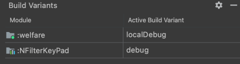
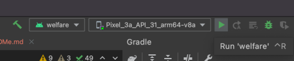
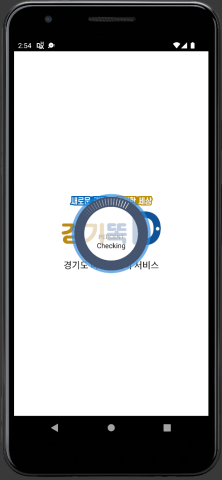
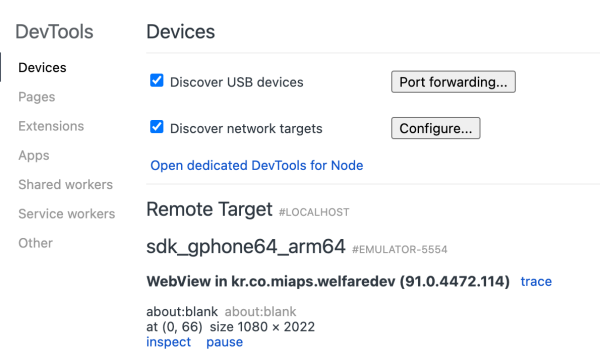
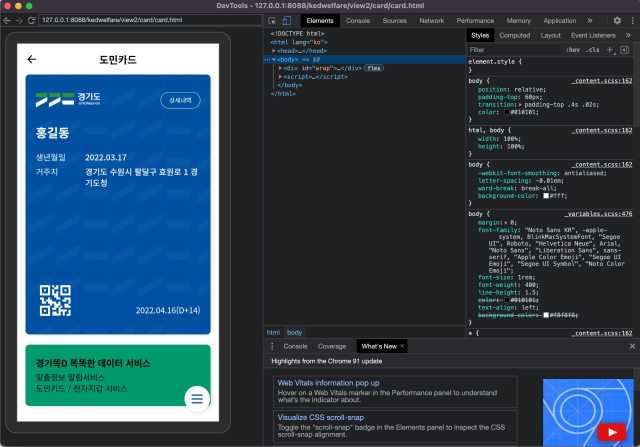

## Local 서버에서 테스트 방법
<br>

1. Android Studio 를 실행한다.<p>

2. File -> Open 메뉴를 선택한 뒤, 다운로드 받은 소스 폴더를 선택한다.<p>

3. Gradle Sync가 완료되면, Android Studio의 View -> Tool Windows -> Build Variants를 선택한다.
   <br>

<p>

4. Android Studio 상단의 Run warfare 버튼을 눌러 에뮬레이터를 실행시킨다.
   <br>
   <p>

   

5. 에뮬레이터에서 앱이 실행될 때까지 대기한다.
   <br>
   <p>

6. 앱이 실행되면 Chrome 브라우저를 실행시킨다.<p>

7. 주소 입력창에 다음과 같이 입력한다.
   ```
   chrome://inspect/#devices
   ```
   <br>

   <p>
     
   </p>

   

8. 화면 하단의 Inspect 버튼을 선택한다.
    <br>

   

   

